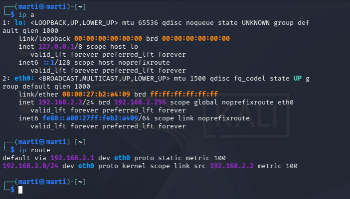
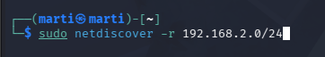
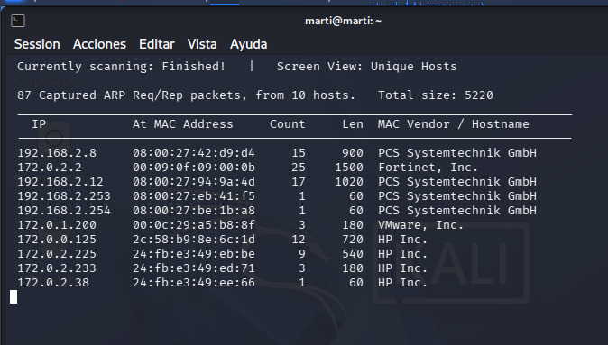
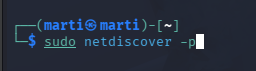
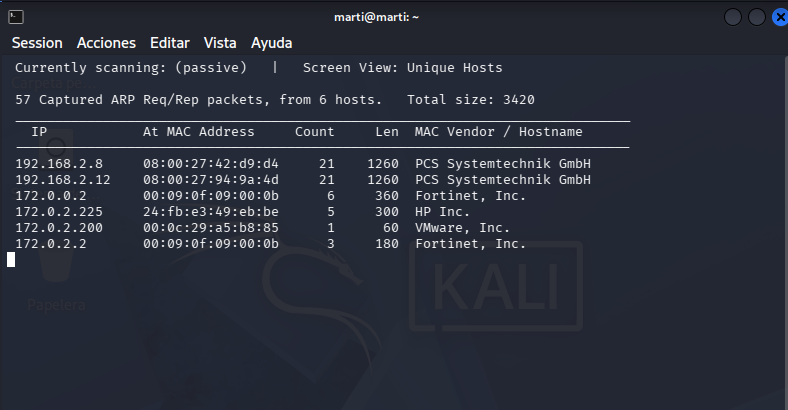
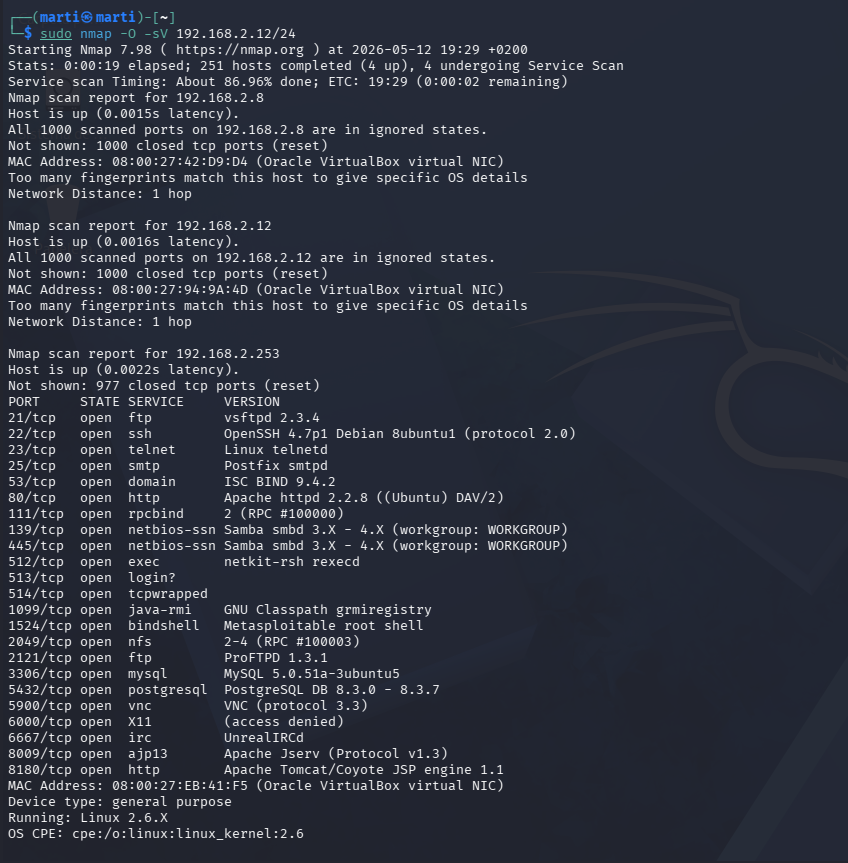

# AA1-ExploracioXarxa

## Activitats

- Utilitzeu un Kali Linux (Live o VM en mode pont).  
- Exploreu la xarxa local tant en mode actiu com passiu amb netdiscover.  
- Noteu alguna diferència entre un mètode i l’altre?  
- Repetiu l’exploració amb Nmap  
- Useu l’opció per determinar el sistema dels equips detectats.  
- Mireu els ports oberts al router i al servidor Ubuntu.

### 1. Configuració de xarxa

Comprovem la IP amb l’ordre ip a i revisem la connexió a la xarxa i la porta d’enllaç amb ip  
route.

### 2. Netdiscover – mode actiu

Comprovem quins dispositius hi ha a la xarxa fent un escaneig amb netdiscover en mode  
actiu, enviant peticions directament per detectar totes les IPs que responen dins del rang  
indicat.

### 3. Netdiscover – mode passiu

Comprovem els dispositius connectats a la xarxa utilitzant netdiscover en mode passiu,  
escoltant el trànsit sense enviar peticions i mostrant només els equips que es detecten de  
manera natural.

### 4. Comparació actiu vs passiu

En el mode normal (actiu) fem peticions directament als equips de la xarxa per descobrir tots  
els dispositius possibles, mentre que en el mode passiu només escoltem el trànsit que ja hi ha a  
la xarxa i detectem únicament els equips que es comuniquen en aquell moment, sense enviar  
cap petició.

### 5. Nmap a un equip de la xarxa (servidor / host)

Analitzem els equips de la xarxa fent un escaneig amb nmap per identificar quins serveis i ports  
tenen oberts i obtenir una idea general del sistema que està funcionant en cada màquina.

### 6. Nmap al router (gateway)

